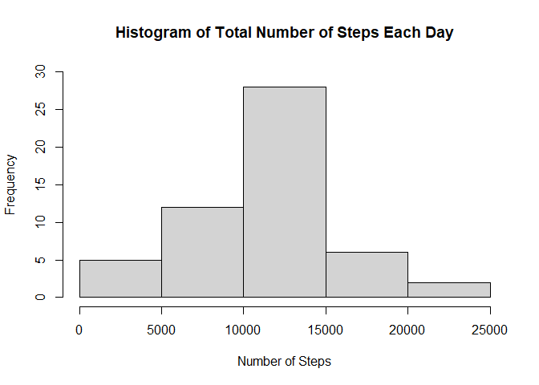
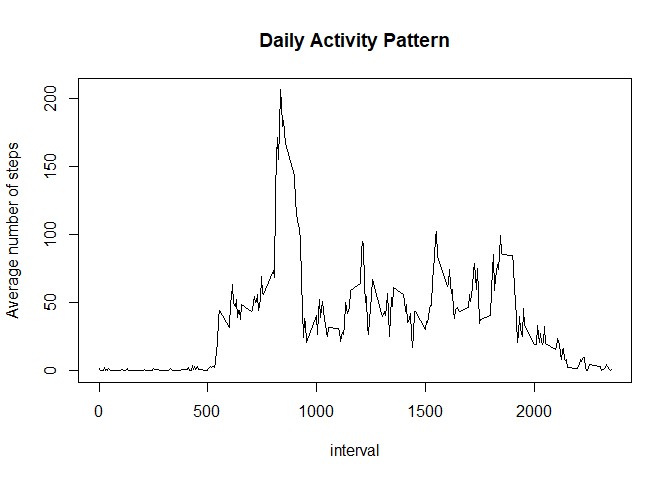
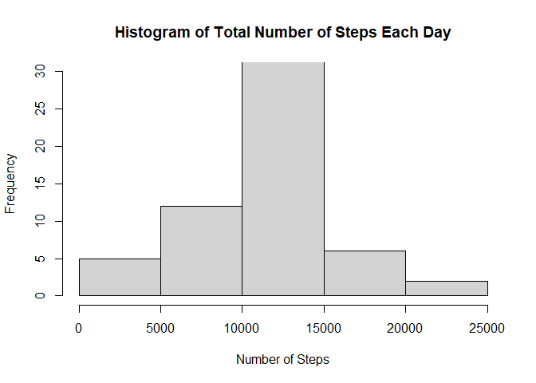
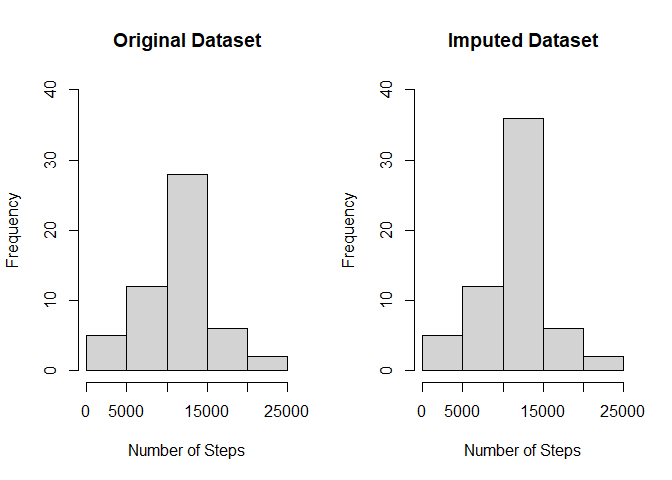
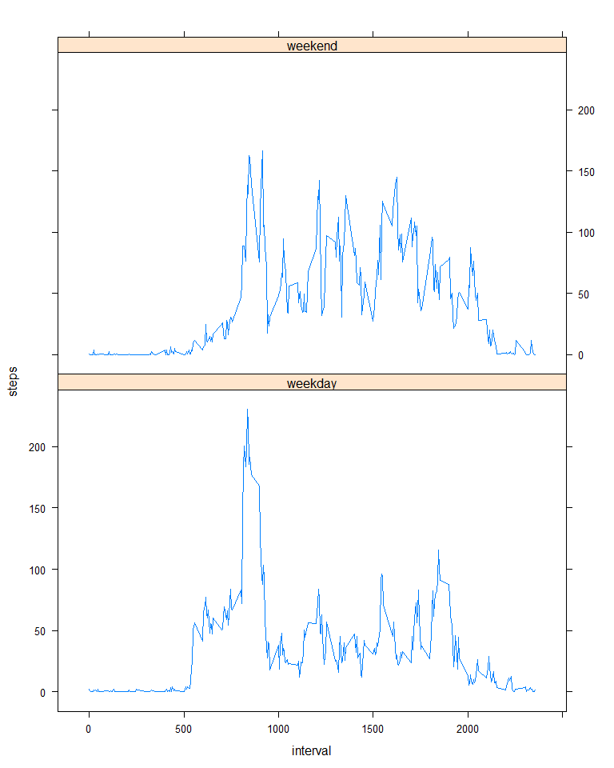

## Loading and preprocessing the data

The data is zipped, hence it needs to be unzipped using `unzip`.


```r
unzip("activity.zip")
activity <- read.csv("activity.csv")
str(activity)
```

```
## 'data.frame':	17568 obs. of  3 variables:
##  $ steps   : int  NA NA NA NA NA NA NA NA NA NA ...
##  $ date    : chr  "2012-10-01" "2012-10-01" "2012-10-01" "2012-10-01" ...
##  $ interval: int  0 5 10 15 20 25 30 35 40 45 ...
```

```r
summary(activity)
```

```
##      steps            date              interval     
##  Min.   :  0.00   Length:17568       Min.   :   0.0  
##  1st Qu.:  0.00   Class :character   1st Qu.: 588.8  
##  Median :  0.00   Mode  :character   Median :1177.5  
##  Mean   : 37.38                      Mean   :1177.5  
##  3rd Qu.: 12.00                      3rd Qu.:1766.2  
##  Max.   :806.00                      Max.   :2355.0  
##  NA's   :2304
```

For preprocessing the data, assign correct data type to date.


```r
activity <- transform(activity, date = as.Date(date, format = "%Y-%m-%d"))
str(activity)
```

```
## 'data.frame':	17568 obs. of  3 variables:
##  $ steps   : int  NA NA NA NA NA NA NA NA NA NA ...
##  $ date    : Date, format: "2012-10-01" "2012-10-01" ...
##  $ interval: int  0 5 10 15 20 25 30 35 40 45 ...
```

```r
summary(activity)
```

```
##      steps             date               interval     
##  Min.   :  0.00   Min.   :2012-10-01   Min.   :   0.0  
##  1st Qu.:  0.00   1st Qu.:2012-10-16   1st Qu.: 588.8  
##  Median :  0.00   Median :2012-10-31   Median :1177.5  
##  Mean   : 37.38   Mean   :2012-10-31   Mean   :1177.5  
##  3rd Qu.: 12.00   3rd Qu.:2012-11-15   3rd Qu.:1766.2  
##  Max.   :806.00   Max.   :2012-11-30   Max.   :2355.0  
##  NA's   :2304
```


## What is mean total number of steps taken per day?

Plotting histogram of total number of steps taken each day:


```r
dailySteps <- aggregate(steps ~ date, data = activity, FUN = sum)
hist(dailySteps$steps, main = "Histogram of Total Number of Steps Each Day", xlab = "Number of Steps", ylim = c(0,30))
```

<!-- -->

Reporting `mean` and `median` number of steps each day:


```r
mean(dailySteps$steps)
## [1] 10766.19
median(dailySteps$steps)
## [1] 10765
```


## What is the average daily activity pattern?

Time series plot of the 5-minute interval and the average number of steps taken, averaged across all days:


```r
dailyActivity <- aggregate(steps ~ interval, data = activity, FUN = mean)
plot(dailyActivity, type = "l", main = "Daily Activity Pattern", ylab = "Average number of steps")
```

<!-- -->

The 5-minute interval which on average across all the days in the dataset, contains the maximum number of steps:


```r
dailyActivity[which.max(dailyActivity$steps),1]
```

```
## [1] 835
```


## Imputing missing values

Reporting the total number of missing values in the dataset:


```r
sum(is.na(activity$steps))
```

```
## [1] 2304
```

Imputing the missing values with the mean for that five minute interval using `dailyActivity` that was defined earlier for creating the time series plot. Defining the function `impute` which gives the mean corresponding to the given interval:


```r
impute <- function(interval) {
        dailyActivity[dailyActivity$interval == interval, ]$steps
}
```

The new data will be stored in new dataset `imputedActivity`:


```r
imputedActivity <- activity
miss <- which(is.na(activity$steps)) # vector containing indices of NAs
miss_int <- activity$interval[miss] # vector containing interval corresponding to missing steps
imputedActivity$steps[miss] <- sapply(miss_int, impute)
summary(imputedActivity)
```

```
##      steps             date               interval     
##  Min.   :  0.00   Min.   :2012-10-01   Min.   :   0.0  
##  1st Qu.:  0.00   1st Qu.:2012-10-16   1st Qu.: 588.8  
##  Median :  0.00   Median :2012-10-31   Median :1177.5  
##  Mean   : 37.38   Mean   :2012-10-31   Mean   :1177.5  
##  3rd Qu.: 27.00   3rd Qu.:2012-11-15   3rd Qu.:1766.2  
##  Max.   :806.00   Max.   :2012-11-30   Max.   :2355.0
```

Plotting histogram of total number of steps taken each day with the imputed dataset:


```r
dailyStepsN <- aggregate(steps ~ date, data = imputedActivity, FUN = sum)
hist(dailyStepsN$steps, main = "Histogram of Total Number of Steps Each Day", xlab = "Number of Steps", ylim = c(0,30))
```

<!-- -->

Reporting `mean` and `median` number of steps each day under imputed data:


```r
mean(dailyStepsN$steps)
## [1] 10766.19
median(dailyStepsN$steps)
## [1] 10766.19
```

The `mean` is exactly the same while the `median` has changed (increased to the same value as the mean). 

Comparing the total daily number of steps in original vs imputed dataset:


```r
par(mfrow = c(1, 2))
hist(dailySteps$steps, main = "Original Dataset", xlab = "Number of Steps", ylim = c(0,40))
hist(dailyStepsN$steps, main = "Imputed Dataset", xlab = "Number of Steps", ylim = c(0,40))
```

<!-- -->

Hence, we see that the number of steps have increased as each missing value has been substituted with a positive value. 

## Are there differences in activity patterns between weekdays and weekends?

Creating a factor variable `day` to distinguish between weekdays and weekends:


```r
imputedActivity$day <- as.factor(ifelse(weekdays(imputedActivity$date) %in% c("Saturday", "Sunday"), "weekend", "weekday"))
summary(imputedActivity)
```

```
##      steps             date               interval           day       
##  Min.   :  0.00   Min.   :2012-10-01   Min.   :   0.0   weekday:12960  
##  1st Qu.:  0.00   1st Qu.:2012-10-16   1st Qu.: 588.8   weekend: 4608  
##  Median :  0.00   Median :2012-10-31   Median :1177.5                  
##  Mean   : 37.38   Mean   :2012-10-31   Mean   :1177.5                  
##  3rd Qu.: 27.00   3rd Qu.:2012-11-15   3rd Qu.:1766.2                  
##  Max.   :806.00   Max.   :2012-11-30   Max.   :2355.0
```

Making time series panel plot (using lattice library) for comparison of activity patterns on weekdays and weekends:


```r
library(lattice)
steps <- aggregate(steps ~ interval + day, imputedActivity, mean)
xyplot(steps ~ interval | day, data = steps, type = "l")
```

<!-- -->
